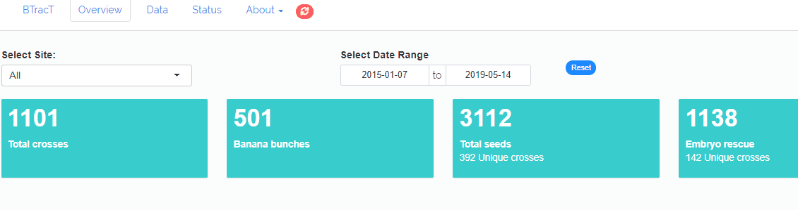
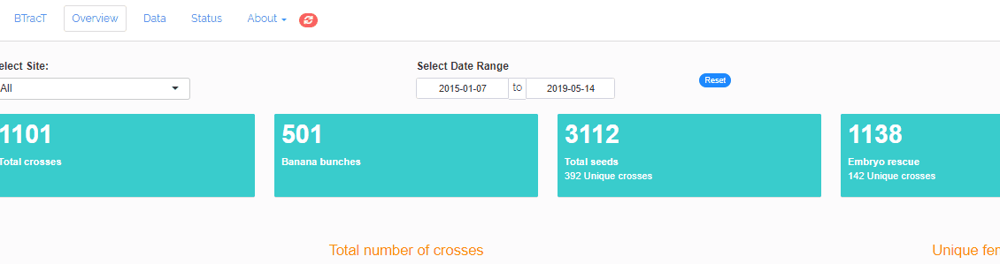
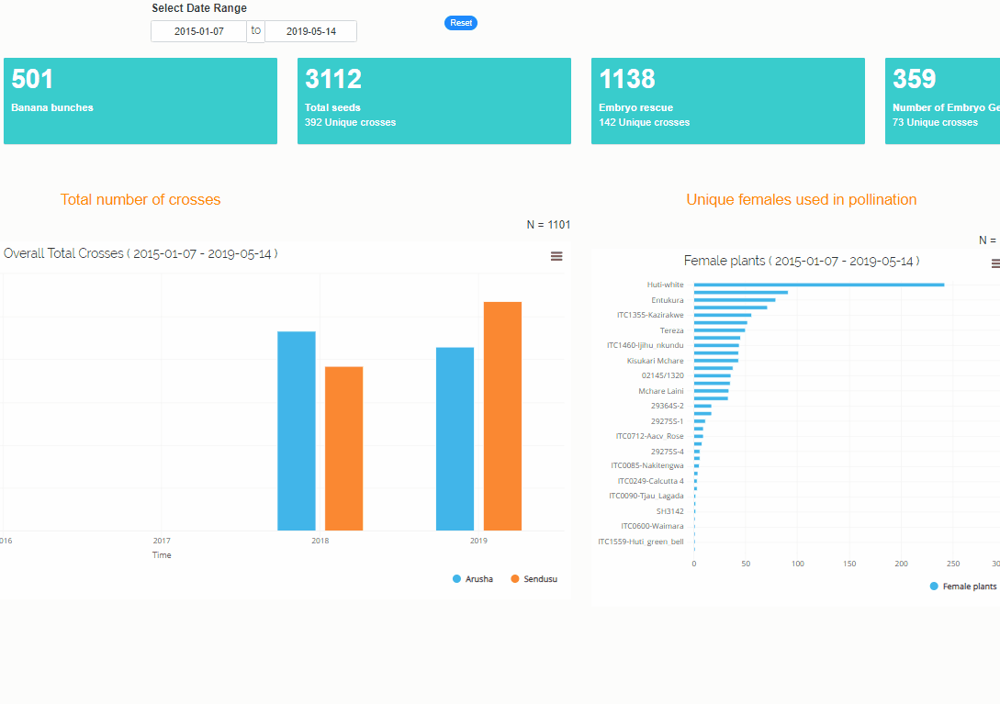

This interactive web application has been designed to provide and easy-to-use interface to visualise crosses and seeds data.
Below is a brie

  

#### Filters
Found on top or sidebar of the page. Useful to filter out to specific records using the site and date range.
{width=800px}

  

  

#### Info- Boxes
Info boxes provide summary counts of accessions/ crosses recorded at various stages in banana breeding using BTracT app.
These are clickable to provide detailed information in a datatable. Data is downloadable though the download button on the right corner of the table.

{width=800px}

  

  

#### Graphs

Hovering on graphs columns shows the specific details per that column. 
Most graphs are reactive on column click. By clicking a column, details regarding the column are opened in a data table
Graphs can be downloaded as 

{width=800px}

  

  

#### Data Table
Display the detailed information on all accessions recorded using BTracT.
Data can be filtered using the filter controls located at the top of the data table.

All or filtered data maybe downloaded using the download button at the top right corner of the table

{width=800px}

  

  

#### TC Label Management
Used in Tissue Culture labs to download accession Ids for barcorde generation.
A video demo for TC label management is available, goto > About Menu > TC Label Management > How to do it

Ds generated must have gone through either of below,

+ Embryo Culture
+ Germination
+ Subculturing

 

 

## Acknowledgements

BTracT system is a result of dedications and efforts of different stakeholders in banana breeding project, in particular, banana breeders, field officers, developers

+ [International Institute of Tropical Agriculture](https://iita.org) (Nairobi, Arusha, Sendusu, Ibadan, Onne)

+ [Boyce Thomsons Institute](https://btiscience.org/)

 

#### Software/ Platforms

+ [Open Data Kit (ODK) Frameworks](https://opendatakit.org/)

+ [Musabase](https://musabase.org)

+ R for Statistical Computing and packages as outlined below,
    + [shiny](https://shiny.rstudio.com/)
    + [data.table](https://cran.r-project.org/web/packages/data.table/index.html)
    + [summarytools](https://cran.r-project.org/web/packages/summarytools/index.html) 
    + [qrencoder](https://cran.r-project.org/web/packages/qrencoder/index.html) 
    + [highcharter](https://cran.r-project.org/web/packages/highcharter/index.html) 
    + [collapsibleTree](https://cran.r-project.org/web/packages/collapsibleTree/index.html) 
    + [tidyverse](https://www.tidyverse.org/) 
    + [brapi](https://github.com/CIP-RIU/brapi)
