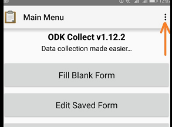
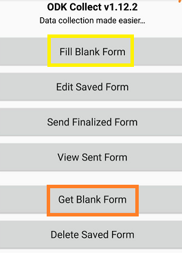
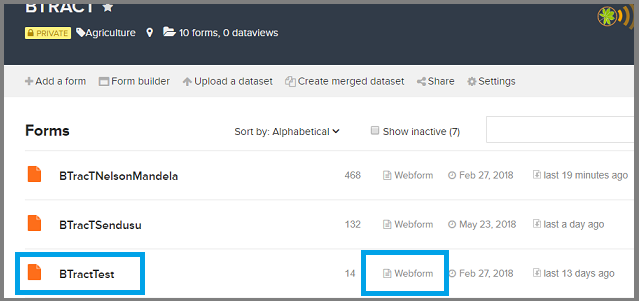

BTracT (Banana Tracking Tool) is a banana tracking system of crosses and seeds. It is made up of three main tools

  * [Musabase](https://musabase.org). This is the global banana breeding database. Use this system to generate the crossing plan
  * Mobile app. Developed using ODK framework. Used for data collection
  * Interactive dashboard. For vizualization and querying of collected data
  

<b>What you need:</b>

Field items

  * Android tablet/ smart phone
  * Zebra ZQ520 - Mobile printer and its labels
  
Laboratory items

  * Zebra ZT410 Printer (with labels and ribbons)
  * Zebra designer software (license)
  * DS2208-SR - barcode Scanner
  * Computer with internet access
  * Labels and ribbons
  
 

# Crossing plan

Follow the Musabase link below to create a crossing plan

https://solgenomics.github.io/sgn/03_managing_breeding_data/03_06.html#cross-wishlist

 

# Data collection

There are two modes of data collection using BTracT,  
(1) using the mobile application (ODK collect) and  
(2) using the webform.  
Mobile application is more applicable for field and nursery activities whereas the webform is for the laboratory activities. 

### Mobile app setup

In the Android tablet, visit playstore to download and install the following

  * [ODK collect](https://play.google.com/store/apps/details?id=org.odk.collect.android&hl=en)
  * [ODK Sensors Framework](https://play.google.com/store/apps/details?id=org.opendatakit.sensors&hl=en)
  * ODK printer driver (contact admin)

Open the ODK collect on the tablet. Go to Menu as shown in the fig below

 

#### Account setup

Select <b>General settings</b> >> <b>Server</b>.  
Here, you are required to enter your login information. Change below fields

  + URL: <i>https//odk.ona.io</i>
  + Username: <i> *********</i>
  + Password: <i> *********</i>

#### Device setup

As above, go to <b>Menu</b> >> <b>General settings</b> >> <b>Form management</b> 
Change the following fields as

  + Form update: <i>Every fifteen minutes</i>
  + Automatic download: <i> check</i>
  + Form submission: 
      + Auto send: <i> check either wifi, cellular or both</i>
  + Form filling:
      + Default to finalized:<i> check</i>
      + Contraint processing: <i> validate upon forward swipe</i>
      
Now you are all set      

 

# Get started

Go back to Main Menu  

 

Load the data collection form on the device by through <b>'Get Blank Form'</b> option.  
Select the form specific to your project site eg. BTractTest

<b> Start recording information</b>

From main menu, go to <b>'Fill Blank Form'</b> 
Select the form displayed on the screen eg. BTractTest.  

A new page is opened. Use the forward/backward buttons or swipes to navigate. 

Next, Select <b>'Record Information'</b> option to proceed.  

* <b>Field activities include</b> (flowering, pollination, harvesting, seed extraction and plant status) 
* <b>Laboratoryactivities</b> (embryo rescue, germination, subculture, rooting, weaning 1/ sending out, and contamination) 
* <b>Nursery activities</b> (weaning 2/ transfer to ice cups, screenhouse/ poting, hardening and transfer to openfield)

 

# Field Activities

Select the Field option and then Add Group. 
Select ADD GROUP in the pop-up box. This recording multiple accessions in same or different stages before finalizing and saving the data. 

## Flowering

Using the swipes or forward/backward buttons, navigate through the tool filling the subsequent questions

a. Select Flowering/ Shooting 
b. Scan the plant barcode 
c. Select the plant sex 
d. Select the date of recording flowering. Date must be the current date

<i>End of flowering record</i>

To record flowering of another plant, select ADD GROUP. Then repeat the steps above to recording another flowering plant. To end session and save the form select DO NOT ADD

Ensure the finalize check box is checked.  Click on Save and exit to save the record

 

## First pollination

Under field activities, select First pollination

a. Geopoint (optional). Record the geopoint of the female plant 
b. First pollination date. Must be the current date 
c. Scan the female plant barcode 
d. Select the male genotype wrt priority and availability of pollen 
e. Scan the male plant whose genotype has been selected in the previous step 
f. Proceed to print the ID and label the plant. A crossID is automatically generated.  
g. Use the label to tag the cross made 

<i> End of first pollination record </i>

Finalize the record and <b>Save and exit </b> to save the record.

 

## Repeat pollination

Under field activities, select Repeat pollination

a. Scan the Crossnumber Id.
    <i> Here, the male genotype to use is displayed </i>
b. Scan male plant of genotype shown in the previous screen 
c. Select today's date as date of repeat pollination 

<i> End of repeat pollination record.</i>  
Finalize the record and <b>Save and exit </b> to save the record.

 

## Bunch harvesting

Under field activities, select Harvest bunches option

a. Date of harvesting. Must be current date (today's) 
b. Scan the bunch barcode.  
    <i>Here you can scan all the banana bunches harvested at a go.  
      Scan each one using ADD GROUP to allow scanning the next. </i> 
c. Finalize bunch harvest by acknowleging being taken to ripening shed 

Finalize the record and <b>Save and exit </b> to save the record.

 

## Seed extraction

Select seed extraction option

a. Scan barcode Id of extracted bunch 
b. Date of extraction (must be today's date) 
c. Total number of seeds extracted 
d. Specify where the seeds will be taken.  
  <i> If there are many seeds, at most 50 should be taken for <b>embryo rescue</b> while the rest to nursery for <b>early germination</b>
    If needed for both embryo rescue and early germination, specify the number for embryo rescue. The remainder should be taken for early germination in nursery.</i> 
e. Print the CrossID and label the bags carrying extracted seeds

Finalize the record and <b>Save and exit </b> to save the record.

 

## Plant status

Under field activities, select Plant status.  
Plant status can be recorded at any stage of accession in the field

a. Select status type 
b. Scan the plant barcode 
c. Date of recording status. Must be current date 
d. Add notes about status 
e. Take photo of the accession 
 
Finalize the record and <b>Save and exit </b> to save the record.

 
 
# Laboratory

Laboratory activities are recorded using the webform. 

Using your internet enabled computer, login to your ONA account, https://ona.io/home/
  Under projects, select BTracT project then the specific BTracT form eg. BTractTest

  
Click the <b>webform</b> as indicated in the fig above. 
Use the resulting questionnaire like form to record data

Proceed to record new information.  
Select 'Record Information' the 'Laboratory' activities

<b> NB:</b> Use <b>tab key</b> to navigate (or go to next question) or <b>Shift + tab key</b> to go  to the previous question. This is usefull for instant validation

 

## Embryo culture

Select Embryo rescue

a. Scan the barcode of embryo rescued 
b. Record date of embryo rescue
  <i> Here the number of seeds sent for embryo rescue is shown</i>
c. Good seeds. Record how many seeds are good

Finalize the record by clicking the <b> Submit</b> button at the bottom of the page.  
If all information is correctly recorded, a success message pops up.  

 

## Germination

Germination can be recorded multiple and flexible times whenever an embryo germinates. The number recorded however must not exceed number of embryo rescued.

Select Germination.

a. Scan the crossId of germinating embryo
    Here a number of information shown 
        * <i> Number of embryo rescued</i>  
        * <i> Number of embryo available</i> 
        * <i> Number of embryo germinating</i>

b. Record date of germination
c. Record number of embryo germinating of that CrossID.

<b>NB:</b> New EmbryoIDs are automatically generated and listed below 

Finalize the record by clicking the <b> Submit</b> button at the bottom of the page.  
If all information is correctly recorded, a success message pops up.  

 

## Subculture

Just like the previous steps/ activities
a. Scan the Id of subcultured embryo
b. Record date of subculturing
c. Record number of copies

Finalize the record by clicking the <b> Submit</b> button at the bottom of the page.  
If all information is correctly recorded, a success message pops up.  

 

## Rooting

a. Scan the Id of rooting plantlets
b. Record date of rooting
c. Record number of copies rooting

Finalize the record by clicking the <b> Submit</b> button at the bottom of the page.  
If all information is correctly recorded, a success message pops up.  
 

## Weaning 1/ Sending out

a. Scan the Id of sent-out plantlets
b. Record date of sending out
c. Record number of copies sent out

Finalize the record by clicking the <b> Submit</b> button at the bottom of the page.  
If all information is correctly recorded, a success message pops up.  
 

## Contamination
  
a. Scan the contaminated Id
b. Record date of contamination
c. Record number of plantlest/ embryo contaminated of this Id
d. Indicate action taken, either
    + Discarded
    + Sent to nursery

 
 
# Nursery

This section uses the tablet with the mobile application (ODK colect) and the mobile printer

## Weaning 2 (Transfer to icecream cups)

a. Scan the plantlet Id
b. Record date of weaning 2
c. Record number of plantlest weaned
d. Record status and take photo of the status recorded

## Screanhouse transfer/ Potting

a. Scan the plantlet Id
b. Record date of potting
c. Record number of potted
d. Record status and take photo of the status recorded

Finalize the record and <b>Save and exit </b> to save the record.

 

## Hardening

a. Scan the plantlet Id
b. Record date of hardening
c. Record number of plantlets
d. Record status and take photo of the status recorded

Finalize the record and <b>Save and exit </b> to save the record.

 

## Transplant to openfield

a. Scan the plantlet Id
b. Record date of openfield transfer
c. Record number of transferred to openfield

Finalize the record and <b>Save and exit </b> to save the record.

 

# Lookup accession details

# Reprint barcodes

# Troubleshoot the device (mobile app)
