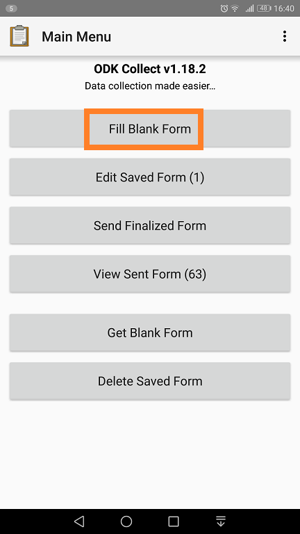

## Get Blank form

Loads your form and data

to the device

## Select form by site

For example, select BtractTest  
Load the form by selecting <b>Get selected </b>at the bottom of the screen

         

## Start data collection

a. Fill Blank form

Select the loaded form in the previous step

<b>BTractTest</b>

---

<b>Use swipes or forward buttons to go to the next screen</b>

  * Select <b>Record information</b>
  * Proceed to select activity category

    

---

Select either depending on your work

   

