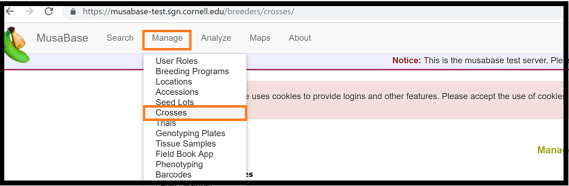
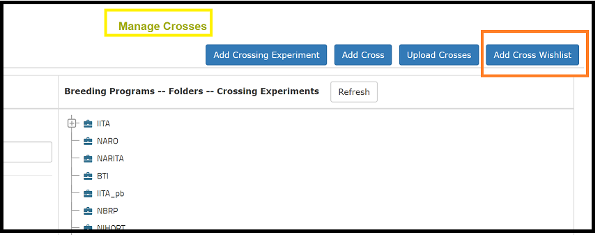
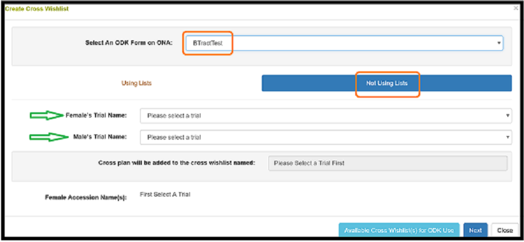
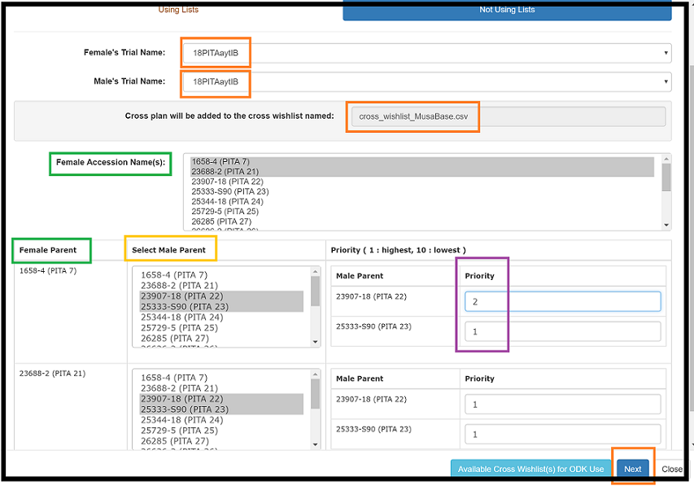
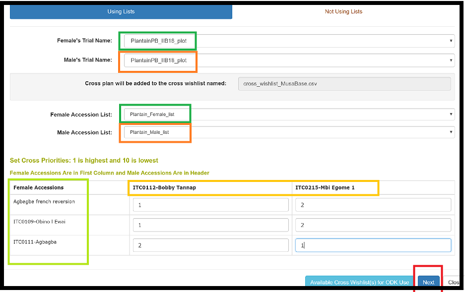
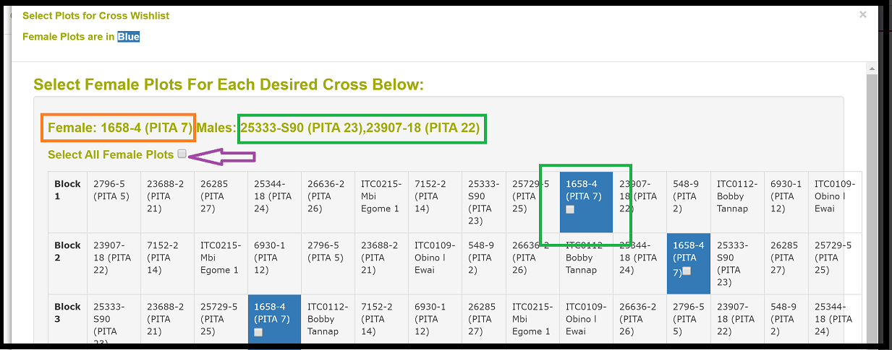

BTracT is a system of integrated tools through API which consists of [Musabase](https://musabase.org) and [Open data kit](https://opendatakit.org/)

In order to use BTracT, you need to 

1. Have an <b>android</b> mobile phone or tablet. Install,
    * [ODK collect](https://play.google.com/store/apps/details?id=org.odk.collect.android&hl=en)
    * [ODK Sensors Framework](https://play.google.com/store/apps/details?id=org.opendatakit.sensors&hl=en)
    * ODK printer driver (contact admin)

2. Mobile printer (zebra zq520)

3. User <b> accounts </b> in
    * Musabase [test site](https://musabase-test.sgn.cornell.edu/breeders/crosses/) or [live site](https://musabase.org) and 
    * [ONA](https://ona.io/home/) (ODK aggregate server)

4. Generate a crossing plan through Musabase

5. Configure mobile phone with user accounts

6. Collect data using mobile devices

 

# 1.0 Crossing plan

Crossing plan is generated with permissions through musabase.org

To create a crossing plan, go to <b>manage menu</b> >> select <b>crosses</b>

 

---

Click on <b> Add Cross Wishlist</b> (see highlight in the figure below)

 

---

 

### 1.1 Using specific field trial names

a. Select your tool, specific to your site eg. BTracTTest in the Musabase test site

 

---

b. Select the <b>Female</b> and <b>Male</b> trials. 
    Select the specific accessions and assign priority.
    Click <b>Next</b>

 

---

 

### 1.2 Using lists 

 

a. First create your <b>female</b> and <b>male</b> lists 

---

<b> Next </b>

b. Select <b>all female plots</b> or <b>specific plots</b> in a block/field.

 

 

 

# 2.0 Configure ODK Collect 

Procedures of installing and setting up ODK collect

 

Read more [here](./odk_setup.html)

 

# 3.0 Data collection 
[BTracT get started](./datacollection.html)

BTracT data collection tool is divided into three main sections

1.  Field Activities
    + [Flowering](./images/btract/data_collect/field/flowering/flowering.html)
    + [First pollination](./images/btract/data_collect/field/firstpollination/firstpollination.html)
    + [Repeat pollination]()
    + [Bunch harvesting]()
    + [Seed extraction]()
    + [Plant status]()
  
   
 
2. Laboratory
    + [Embryo culture]()
    + [Embryo germination]()
    + [Tissue culture]()
    + [Rooting]()
    + [Contamination]()
  
  
 
3. Nursery
    + [Potting]()
    + [Hardening]()
    + [Open field]()
 

