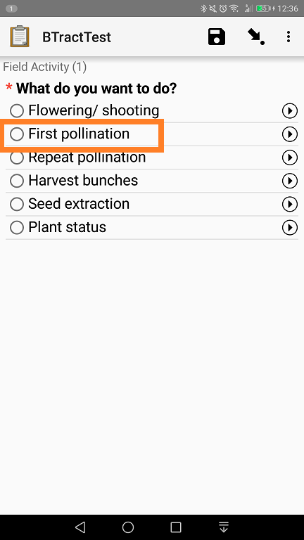
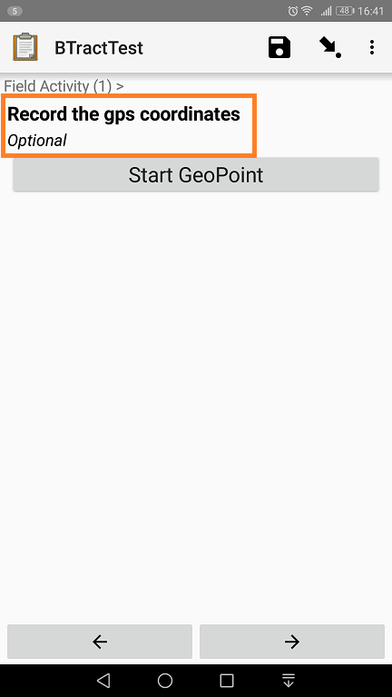
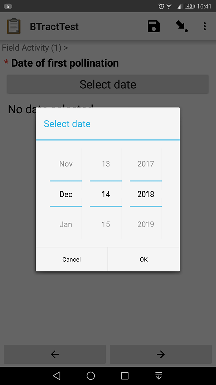
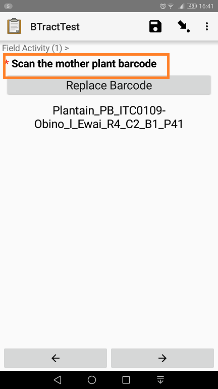
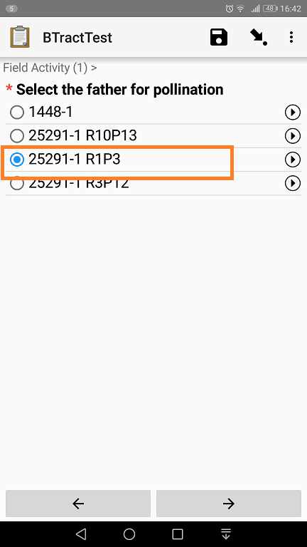
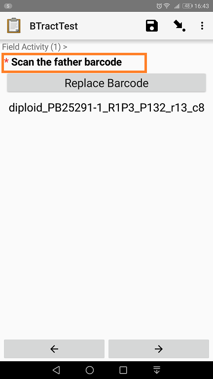
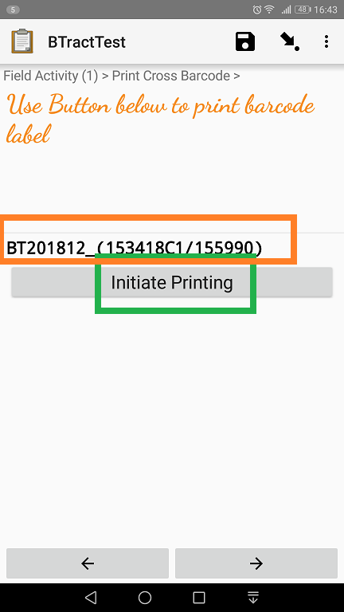
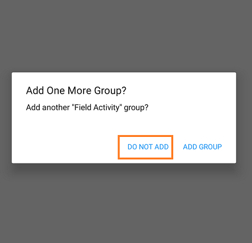
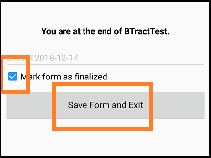

## First pollination

Select First pollination

<b>Swipe forward</b>

## Geopoint (optional)

Record the geopoint of the female plant

<b>Swipe forward</b>

## First pollination date

First pollination date - today's date

<b>Swipe forward</b>

## Female plant

Scan the female plant barcode

<b>Swipe forward</b>

## Male genotype

Select the male genotype wrt priority and availability of pollen

<b>Swipe forward</b>

## Male plant

Scan the male plant whose genotype has been selected in the previous step

<b>Swipe forward</b>

## Print CrossID

A crossID is automatically generated. Proceed to print the ID and label the plant

---

Use the label to tag the cross made

Click on  DO NOT ADD

## Save and Exit

Check Mark as finalized

Click on save and exit to save the record

