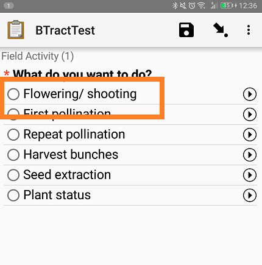
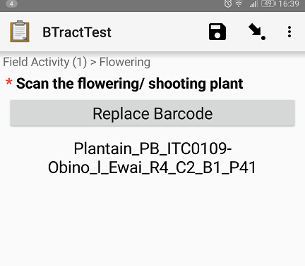
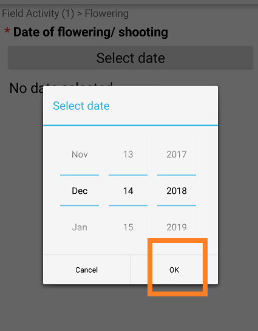
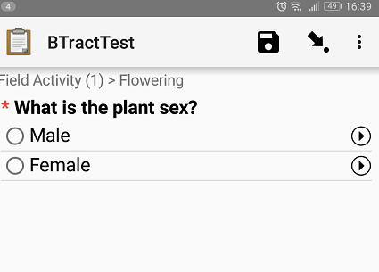

## Select flowering/ shooting

<b>Swipe forward</b>

## Scan the flowering plant barcode

<b>Swipe forward</b>

## Flowering date

Select today's date

<b>Swipe forward</b>

## Select plant sex

<b>Swipe forward</b>

## Save and Exit

Click on  DO NOT ADD

---
Make sure the check box
mark as finalized is checked

Click on save and exit to save the record

