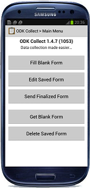
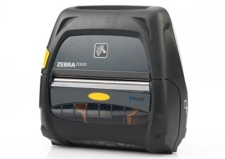
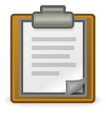
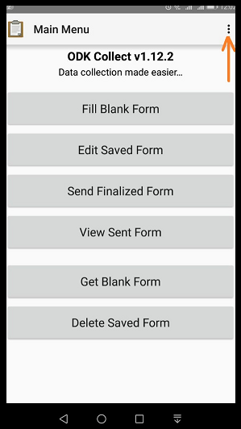
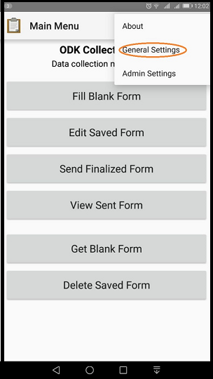
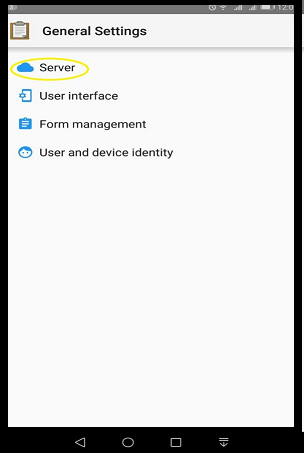
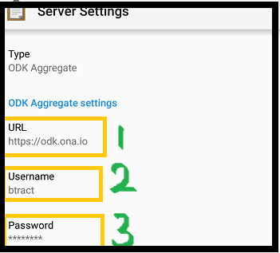
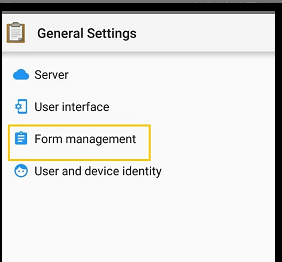
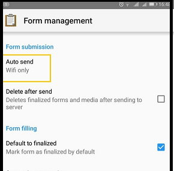

## What you need 

  

  - Android mobile phone or tablet
  
  - Zebra ZQ520 mobile printer
  
  
  
    
  

## Install apps 

On your mobile phone, go to <b>play store</b> and download
  
+  [ODK collect](https://play.google.com/store/apps/details?id=org.odk.collect.android&hl=en)
+  [ODK Sensors Framework](https://play.google.com/store/apps/details?id=org.opendatakit.sensors&hl=en)
+  ODK printer driver (contact admin)

## Configuration

  

  <b>Open ODK collect </b>
   
  
  
   
  Go to the Menu (top right corner)
  
  

  

---

### a. Login details

Go to <b>General settings</b> as indicated in the fig

 

---

Select <b>Server </b> settings

 

---

Replace the default information with your <u> login info</u>

 

<b>URL:</b> <em>https://ona.io</em>

<b>Username:</b> <em>your username</em>

<b>Password:</b> <em>your password</em>

 

---

### b. Form management

 

Go to the MENU

 

Select auto send - set to wifi or data

# End of Configuration

